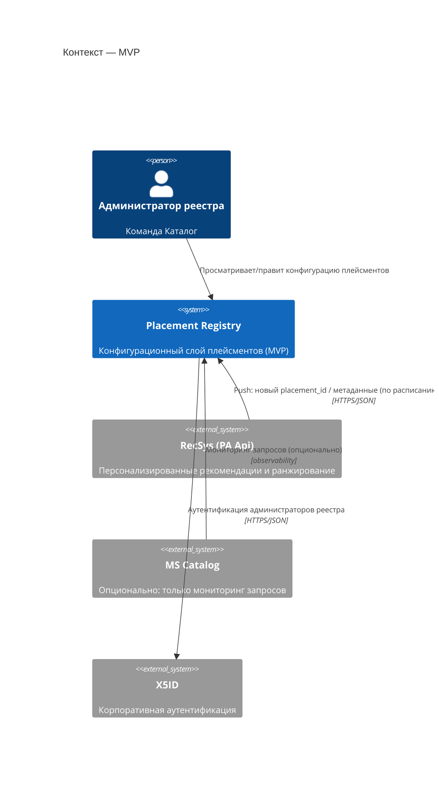
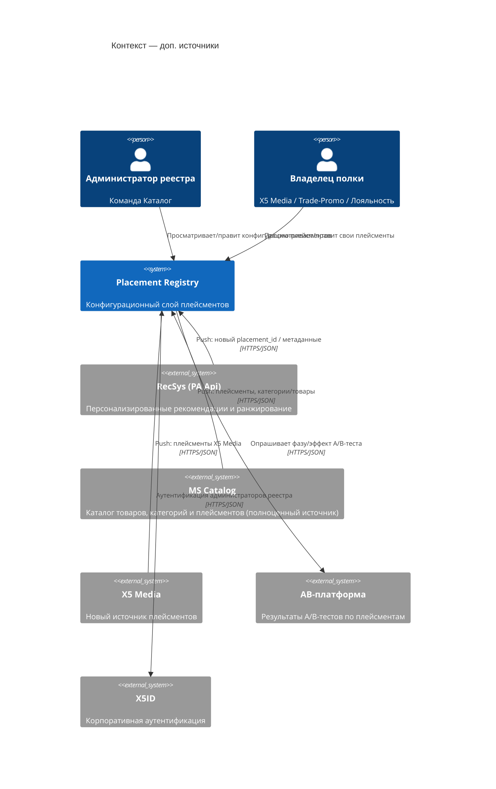
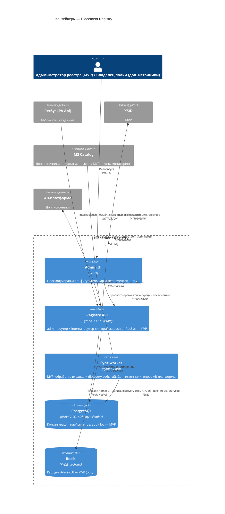

# Реестр плейсментов товарных подборок — архитектура (v0.2)

> Обновлено 2026-08-27: единая последовательность этапов — MVP → Этап 2 (админка) → Этап 3 (правила встраивания медиа-объектов); добавлены §10-12.

## 1. Назначение

Реестр плейсментов товарных подборок - сервис для учета и управления товарными плейсментами на
экранах МП ТС5. Сейчас управление распределёно между разными владельцами, нет понимания об их управлении, нет учета,
часть полок не персонализирована.

Эволюция сервиса (этапность сквозная — повторяется в стеке §2 и интеграциях §5):

1. **MVP** — учётка плейсментов RecSys: реестр, просмотр конфигурации, карта полок. Из внешних
   источников — только RecSys, и интеграция **входящая**: RecSys сам по расписанию/триггеру
   (например, появился новый `placement_id`) присылает данные о своих плейсментах в реестр.
   Реестр на MVP ничего не отдаёт наружу — он получатель, а не источник для других сервисов.
   Catalog не интегрируем, максимум — мониторинг запросов от него.

2. **Этап 2 — развёртывание админки** - UI реестра встраивается точкой входа в единую админку
   компании (см. §11), сразу после готовности сервиса на MVP.
3. **Этап 3 — управление правилами встраивания медиа-объектов** — реестр становится местом, где
   настраиваются правила встраивания промотируемых объектов стейкхолдеров (X5 Media, Маркетинг,
   Контент, Рецепты, Трейд-промо) в рекомендательные листинги: приоритет и fallback-цепочка
   стейкхолдеров, разрешённые типы объектов и частота, правила разнообразия, глобальные
   настройки (см. §10, `MEDIA_INTEGRATION.md`). Финальная интеграция кандидатов от
   стейкхолдеров и сборка правил в MS Catalog/Splitter BFF (развилка, §12) — последний шаг,
   идёт после этого этапа либо параллельно с ним.

Отдельно от этой последовательности: подключение дополнительных источников данных о плейсментах
(Catalog как полноценный источник, X5 Media, синхронизация с AB-платформой) — см. §5, §6, §8.2.

Разделение ответственности: **реестр плейсментов учитывает и описывает источники и
конфигурацию**, сами источники (RecSys, далее Catalog/X5 Media) продолжают отвечать за
ранжирование и выдачу контента самостоятельно.

## 2. Технологический стек

Стек выровнен с эталонным сервисом MS Catalog, чтобы переиспользовать корпоративную
инфраструктуру и не вводить для платформы новый язык/раннер. Колонка **Этап** показывает,
что нужно поднимать сразу для MVP, а что подключается позже — та же фазировка, что в §1 и §5.

| Слой | Технология | Этап | Комментарий |
|---|---|---|---|
| Язык/фреймворк | Python 3.11, FastAPI + uvicorn | MVP | `ORJSONResponse` по умолчанию, Pydantic v2 |
| БД | PostgreSQL (в проде у Catalog — Citus) | MVP | через `x5d-db`, миграции — Alembic |
| ORM | SQLAlchemy 2.0 (async) + asyncpg | MVP | репозитории — тонкий слой над SQLAlchemy |
| Кэш | Redis + `cashews` | MVP (опц.) | кэш для Admin UI; не критичен, пока нет внешних потребителей конфигурации |
| Очереди/фон. задачи | `arq` (Redis-backed) | Доп. источники | на MVP не нужен: push от RecSys обрабатывается синхронно в request-хендлере; нужен при подключении доп. источников для периодического опроса AB-платформы |
| Приём входящих данных RecSys | webhook/`internal`-эндпоинт (без исходящего клиента) | MVP | RecSys сам пушит данные — не нужен HTTP-клиент к RecSys на MVP |
| Метрики по плейсментам | Grafana/Prometheus как read-only datasource | MVP | реестр читает RPS/p95/error_rate по label `placement_id` ручки `/context` Каталога напрямую из Grafana — без изменений в Catalog; см. `prototypes/integration-requirements.html` |
| Аутентификация | X5ID (через `x5d-web` `X5IdClient`) + request signing middleware | MVP | сама аутентификация нужна с MVP; роль «Владелец полки» — при подключении доп. источников (см. §7) |
| Observability | `x5d-monitoring` (логирование, APM, Prometheus), health-checks из `x5d-web` | MVP | в т.ч. опциональный мониторинг запросов от Catalog |
| Контракты API | OpenAPI (FastAPI автогенерация) + `schemathesis` для контрактных тестов | MVP | |
| Сборка | Docker, корп. базовый образ `docker-5dl-prod.x5.ru/infra/base_image/python:3.11-slim-rc` | MVP | публикация в корп. registry |
| Фронтенд (админка реестра) | React | MVP | отдельный SPA, обращается к `admin`-API (см. §3) |
| CI/lint | `isort` + `black` + `flake8`, корп. образ `python_code_toolkit` | MVP | покрытие тестами ≥ 87% (порог как у MS Catalog) — целевой ориентир для реестра |
| Клиент Catalog | по аналогии с `OMSClientSettings`/`OmniSearchClientSettings` | Доп. источники | полноценный источник (плейсменты, категории/товары), не только мониторинг |
| Клиент X5 Media | новый HTTP-клиент (готового в MS Catalog нет) | Доп. источники | новый источник плейсментов |
| Клиент AB-платформы | синхронизация `ab_status` через `arq`-воркер | Доп. источники | без Kafka — по расписанию/триггеру |
| Брокер событий | Kafka (`aiokafka` / Faust-консьюмеры) | Доп. источники | подключается, когда появятся реальные event-driven интеграции (см. §6) |
| Эндпоинт отдачи правил встраивания | часть `admin`/`internal`-API реестра | Этап 3 | реестр начинает отдавать правила встраивания потребителю (MS Catalog или Splitter BFF) — см. §10, §12 |

**Не подтверждено и требует уточнения:** шаблон `.gitlab-ci.yml`, Helm-чарты/k8s-манифесты -
в локальной копии MS Catalog отсутствуют, нужно получить у DevOps/платформенной команды
(см. §9).

## 3. Структура сервиса

Слоистая архитектура — повтор паттерна MS Catalog:

```
routers/          # HTTP-слой: admin / internal / public / (widgets — не нужен реестру)
  admin/           — просмотр/правка конфигурации плейсментов (Read+Update; Create — авто
                     через discovery, не руками), ролевой доступ, аудит-лог
  internal/        — MVP: приём входящих данных от RecSys (push по расписанию/триггеру).
                     Этап 3: отдача правил встраивания потребителю (MS Catalog/Splitter BFF)
  public/          — health checks, версия API
services/         # бизнес-логика, интерфейсы, схемы запросов/ответов
domain_services/  # доменные правила (валидация конфигурации, переходы статусов, discovery)
repositories/      # доступ к Postgres (конфигурация, аудит) и Redis (кэш)
db/uow.py          # Unit of Work — транзакционные границы
tasks/             # arq-воркеры: фоновая синхронизация источников, обработка discovery-событий
settings/           # pydantic-settings, по образцу MS Catalog (env_prefix на каждый блок настроек)
cli/                # typer-CLI для админ-операций (миграции, ручная синхронизация)
```

API сегментировано по аудитории, как в MS Catalog (`admin/internal/public/widgets`):
у реестра плейсментов нужны как минимум `admin` (UI реестра) и `internal` (на MVP — приём
входящих данных от RecSys, не отдача); `widgets`-сегмент, специфичный для Catalog, реестру
не нужен.

## 4. Доменная модель (по материалам прототипа)

Ключевая сущность — **Placement**:

| Поле | Назначение |
|---|---|
| `id` (placement_id) | устойчивый ключ вида `home.recsys.foryou` |
| `title`, `screen` | отображаемое имя и экран МП |
| `owner` | владелец полки: Каталог / X5 Media / Trade-Promo / Лояльность |
| `source` | источник выдачи: `recsys` / `pbase` / `catalog` / `customer` |
| `formation_type`, `ranking_type` | способ формирования и ранжирования (ml / rule-based / manual) |
| `personalization`, `context_type` | признак персонализации и тип контекста |
| `limit`, `fallback_type` | лимит товаров и фоллбэк-стратегия при недоступности источника |
| `status` | `active` / `draft` |
| `ab_status` | фаза A/B-теста и бизнес-эффект (`delta_margin`, `delta_items`) |
| `metrics` | runtime-метрики: rps, p95, error_rate |
| `business` | бизнес-метрики: РТО, маржа, CTR |

Сопутствующие сущности: **DiscoveryEvent** (автообнаружение нового `placement_id` в трафике МП,
статусы `pending` → `synced`), **AuditLog** (история изменений конфигурации).

## 5. Интеграции

### MVP

- **RecSys** — единственная обязательная интеграция конфигурации, и она **входящая**: RecSys сам
  по расписанию/триггеру отправляет данные о своих плейсментах (новый `placement_id`, метаданные)
  на `internal`-эндпоинт реестра. Реестру не нужен исходящий HTTP-клиент к RecSys на MVP.
- **Catalog → Grafana/Prometheus (метрики)** — реестр подключается к Grafana/Prometheus как
  read-only datasource (изменений в коде Catalog не требуется) и читает по `placement_id`
  метрики ручки `/context`: RPS, p95 latency, error rate, last_request. Реальный поток запроса:
  МП → `MS Catalog /api/catalog/v3/recommendations/context` (с `placement_id` и `x5id`) →
  `RecSys /api/v2/recommendations/personal_recommendation`. Открытые вопросы по интеграции —
  `prototypes/integration-requirements.html`.

### Доп. источники данных о плейсментах

- **Catalog (полноценно)** — также входящая интеграция: Catalog присылает свои плейсменты и
  справочник товаров/категорий в реестр, по аналогии с тем, как сам Catalog принимает данные
  от смежных систем (`OMSClientSettings`, `OmniSearchClientSettings`, `OfferHubSettings`).
- **X5 Media** — новый источник плейсментов, входящая интеграция; готового корпоративного
  клиента нет, нужен новый webhook/`internal`-эндпоинт на нашей стороне.
- **AB-платформа** — здесь направление другое: это реестр сам **опрашивает** AB-платформу
  (`ab_status`) по расписанию (`arq`-воркер), без Kafka — потому что у AB-платформы нет push
  в нашу сторону.

## 6. Kafka

На MVP Kafka не подключаем — синхронизация конфигурации с источниками идёт через
`arq`-воркеры по расписанию/триггеру. Kafka подключается при подключении доп. источников, когда появятся:
- событие "конфигурация плейсмента изменилась" → инвалидация кэша у потребителей (RecSys/Catalog);
- событие "обнаружен новый placement_id" в реальном времени, а не батчем.

В этот момент имеет смысл повторить паттерн MS Catalog: `aiokafka`-продьюсеры
(`app/kafka/producers.py`) + Faust-консьюмеры как отдельные сервисы в `docker-compose`.

## 7. Auth и роли

- Аутентификация — X5ID через `x5d-web` (`X5IdClient`, request signing middleware), без
  собственной реализации auth. Нужна с MVP.
- Роли (бизнес-уровень, поверх X5ID): **Администратор реестра** (команда Каталог — полный
  доступ к конфигурации) и **Владелец полки** (Media/Trade-Promo/Лояльность — доступ к своим
  плейсментам, без права менять чужие) — роли в MVP не делаем, только admin; разделение на
  Владельца полки появляется при подключении доп. источников.

## 8. C4-диаграммы

Построены по образу C2-схемы «AS IS» ЕМП. Нотация и блоки реальных систем (Catalog, RecSys,
X5ID, API Gateway) взяты оттуда. Сужено до контура, непосредственно касающегося реестра.
Диаграммы — в Mermaid C4, чтобы рендерились прямо в GitHub/GitLab без дополнительных
инструментов; при переносе в корпоративный стандарт (drawio, C2/C3) — пересобрать по тому же
содержанию в принятой нотации (прямоугольники `Имя [Тип: технология]`, цилиндры БД, пунктирная
граница внешних клиентов).

> Здесь и в §8.2 диаграммы намеренно без API Gateway: на MVP и при подключении доп. источников
> реестр ничего не отдаёт потребителям при сборке выдачи, поэтому Gateway с реестром не
> взаимодействует (отдача правил встраивания потребителям — отдельная линия развития, Этап 3,
> см. §10, §12). Эти же диаграммы дублируются в `diagrams/*.drawio` с ортогональными
> линиями без пересечения блоков — Mermaid здесь оставлен для быстрого просмотра в GitHub.

### 8.1 Контекст — MVP

Только обязательная интеграция (RecSys, входящая), одна роль (Администратор реестра).
Catalog — опциональный источник мониторинга, без обмена конфигурацией.



### 8.2 Контекст — доп. источники данных о плейсментах

Добавляются роль «Владелец полки» и входящие интеграции с X5 Media и Catalog; AB-платформу
реестр сам опрашивает (единственная исходящая связь на этом этапе).



### 8.3 Контейнеры (Container) сервиса Placement Registry



## 9. Открытые вопросы / что нужно дозаполнить

1. **C4-диаграммы** — готовы Context MVP (§8.1), Context «доп. источники» (§8.2) и Container (§8.3);
   те же три диаграммы продублированы как `.drawio`-файлы с ортогональными/закруглёнными
   линиями (без пересечения блоков) в `diagrams/context-mvp.drawio`, `diagrams/context-stage2.drawio`,
   `diagrams/container.drawio` — для открытия в draw.io и переноса в корпоративный стандарт.
2. **CI/CD и деплой** — нет образца `.gitlab-ci.yml` и k8s-манифестов/Helm-чартов в локальной
   копии MS Catalog; нужно запросить у платформенной команды или найти в каталоге сервисов.
3. **Архитектурное согласование** — по итогам встречи с лидом бэкенда Каталога (2026-06-26):
   разработка скорее всего перейдёт команде Рекомендаций Каталога. Следующий шаг — показать
   им идею и сервис, затем обсудить с лидом разработки (верхнеуровневый анализ, валидация
   архитектуры/диаграмм), и только
   после этого — арх. комитет/грумминги. Порядок задач закреплён в `TASKS.md`.
4. **Оценка backend** — получена предварительная структурированная оценка от лида бэкенда
   Каталога (2026-06-26, до решения о взятии в работу и выделения ресурсов): анализ/согласование
   5–7 дней, инфраструктура (DevOps) 2 дня, пустой сервис 7 дней, приёмная ручка для push от
   RecSys 5–7 дней, ресёрч интеграции с Grafana 2 дня, Admin UI 5 дней — итого **26–30 дней**
   (полная разбивка — `TASKS.md`). Часть этапов может идти параллельно, календарный срок может
   быть короче. Отдельно: оценка самого RecSys на их часть (push на их стороне) — 3–4 дня
   разработки + ~2 дня тесты/публикация на интеграционной платформе.
5. **Состав плейсментов RecSys: поиск/листинг — включать в реестр или нет?** Комментарий
   коллеги из RecSys: плейсменты поиска/листинга (4, максимум 6 — по 2 на каждую из 3 торговых
   сетей) сейчас хранятся не в БД, а зашиты в коде сервиса **RecProcessing** (в отличие от
   остальных плейсментов, которые лежат в БД и которыми управляет сам RecSys через push в
   реестр). Сделать ручку для передачи этих плейсментов в реестр технически не проблема, но
   RecSys предлагает дождаться перехода RecProcessing с Python на Go — чтобы не делать работу
   дважды.
   **Решение пока не принято** — вопрос остаётся открытым: пока поиск/листинг не исключаем из
   скоупа явно, но и не берём в работу до перехода RecProcessing с Python на Go.

6. **Оценка Этапа 3 (правила встраивания).** Оценка 26-30 дней (п.4) дана до появления требований
   по встраиванию медиа-объектов и покрывает только MVP/учёт. Разработчику переданы материалы
   (`MEDIA_INTEGRATION.md`, УТП, транскрипт встречи 2026-08-27) для отдельной оценки по пунктам —
   см. `TASKS.md`, Этап 3. Отдельно попросили отметить, какие пункты можно распараллелить между
   двумя разработчиками.
7. **Развилка MS Catalog vs Splitter BFF** — см. §12. Решение не принято, нужна отдельная встреча
   с командами Splitter BFF и LEGO.
8. **Точка входа админки (Этап 2)** — единая админка или отдельный SPA. Для оценки нужны
   фронтенд-ресурсы, которых пока нет в команде (встреча 2026-08-27).


## 10. Правила встраивания медиа-объектов (Этап 3)

Третий этап развития реестра, после MVP и развёртывания админки (Этап 2): управление правилами
встраивания промотируемых объектов стейкхолдеров в рекомендательные листинги. Инициатива
зафиксирована отдельно от учётного MVP (см. `MEDIA_INTEGRATION.md`, v0.4, 2026-08-07 →
2026-08-27) и требует отдельной оценки (см. `TASKS.md`, Этап 3).

### 10.1 Проблема

Плейсменты рекомендаций формирует RecSys — персонализированная выдача под пользователя.
Коммерческие направления (X5 Media/Реклама, Маркетинг, Трейд-промо) и Контент/Рецепты хотят
встраивать в эти листинги свои объекты (баннеры, промотируемые товары, карусели, рецепты).
Правила встраивания сейчас разбросаны по коду Catalog и PRD — изменить правило означает правку
кода и релиз, приоритет между стейкхолдерами не настраивается без разработки.

### 10.2 Стейкхолдеры

| Стейкхолдер | Как поставляет контент | Примеры объектов |
|---|---|---|
| **X5 Media (Реклама)** | Realtime — Catalog/BFF запрашивает AdSDK при каждом запросе пользователя (аукцион, таймаут 100 мс) | Медиабаннер, видео-баннер, спонсированная карточка товара |
| **Маркетинг** | Pre-cached — объекты заранее поставлены в Catalog (источник — pBase и/или X5 Media, уточняется) | Карусель товаров, баннер |
| **Контент** | Pre-cached — объекты заранее поставлены в Catalog из pBase | Ручные подборки, полки |
| **Рецепты** | Pre-cached — отдельный сервис и команда (не часть Контента) | Карточки рецептов |
| **Трейд-промо** | Pre-cached из pBase | Акционные товарные подборки |

Реестр хранит приоритет между стейкхолдерами и fallback-цепочку для каждого плейсмента;
стейкхолдеры доступа к правилам не имеют — управляет только admin реестра (команда Каталога).

> Уточнено 2026-08-27: «Рецепты» — самостоятельный стейкхолдер (отдельный сервис/команда), не
> тип объекта внутри «Контента». Приоритет и fallback-позиция «Рецептов» и «Трейд-промо» в
> цепочке конкретного плейсмента `main.endless_recommendation` пока не определены — см. §9 п.6.

### 10.3 Типы объектов

| Тип | Логика позиции | Пример правила | Статус |
|---|---|---|---|
| `media_banner` | Тайловая, плитка в сетке | Каждая 5-я плитка | MVP |
| `product_card` | Тайловая, спонсированная карточка товара | Каждая 5-я плитка | P1 |
| `video_banner` | Тайловая, автовоспроизведение | Каждая 5-я плитка | Бета |
| `product_carousel` | Строчная, вся ширина экрана | Не раньше 3-й строки, далее каждые N строк | P1 |
| `recipe` | Тайловая, карточка рецепта | Каждая 10-я плитка | P2 |
| `stub_banner` | Тайловая, системный fallback | Всегда активен | — |

Тайловые и строчные объекты позиционируются по разным осям (номер плитки vs номер строки) —
реестр хранит тип позиционирования отдельно для каждого разрешённого объекта, смешивать в одном
правиле нельзя.

### 10.4 Правила разнообразия и глобальные настройки

Два независимых уровня: не два объекта одного стейкхолдера подряд (жёстче, рекомендуется всегда
включать), не два объекта одного типа подряд (мягче, опционально). При конфликте сначала
расслабляется правило по типу. Глобально — лимит объектов на скролл и поведение fallback
(заменить товаром / показать заглушку / схлопнуть позицию).

### 10.5 Admin UI

В карточке плейсмента — раздел «Правила встраивания» из пяти блоков: (1) стейкхолдеры и
приоритет — drag-and-drop, видно realtime/pre-cached; (2) разрешённые типы объектов — вкл/выкл,
допустимые стейкхолдеры, частота/интервал; (3) правила разнообразия — два тогла; (4) глобальные
настройки; (5) метрики по плейсменту — CTR, fill rate, stub rate, read-only из Grafana (та же
интеграция, что и в MVP, §5).

Полная модель данных (YAML) и пример контракта синхронизации с Catalog — `MEDIA_INTEGRATION.md`.

## 11. Развёртывание админки (Этап 2)

Сам backend-сервис реестра (учёт + правила встраивания) остаётся отдельным сервисом независимо
от того, где физически размещается UI (по итогам встречи 2026-08-27). Планируется не заводить
отдельную самостоятельную админку, а встроить UI реестра точкой входа в единую админку компании —
рядом с контуром LEGO/BDUI, по аналогии с тем, как туда собираются другие разрозненные сервисы.
Технически это может быть как отдельный домен/SPA, на который единая админка просто ссылается,
так и полноценная интеграция во фронтенд единой админки — вариант пока не выбран, требует
отдельного обсуждения с командой единой админки.

Этап 2 идёт сразу после готовности сервиса на MVP — раньше доработки правил встраивания
(Этап 3, §10) и финальной интеграции через Splitter BFF (развилка MS Catalog vs BFF, §12).

Задачи по этому этапу — `TASKS.md`, раздел «Этап 2». Оценка не дана: по итогам встречи
2026-08-27 для оценки нужны фронтенд-ресурсы, которых пока нет в команде.

## 12. Развилка исполнения: MS Catalog vs Splitter BFF (открытый вопрос)

Отдельный от Admin UI вопрос — где во время обработки запроса пользователя происходит слияние:
рекомендаций RecSys + правил встраивания из реестра + кандидатов от стейкхолдеров. Рассматриваются
два варианта (полный анализ — материалы встречи 2026-08-27, «Анализ вариантов через BFF и
каталог»):

**Вариант 1 — в MS Catalog.** Расширяется существующая ручка
`/api/catalog/v3/recommendations/context`: Catalog раз в час забирает правила из реестра и
кэширует, при запросе пользователя параллельно опрашивает RecSys и X5 Media AdSDK (таймаут
100 мс), берёт кандидатов Маркетинга/Контента/Рецептов/Трейд-промо из своего кэша и сам применяет
правила (приоритет, частота, разнообразие). Адрес вызова для МП не меняется, релиз мобильного
приложения не нужен.

**Вариант 2 — в Splitter BFF.** Уже существующий BFF-слой X5 (`common-backend/splitter`, единая
точка входа МП для нескольких сценариев, паттерн: параллельный fan-out + merge + graceful
degradation, используется для `estimate` и `user/orders`) получает новую ручку
`GET /api/splitter/public/v1/placement/{placement_id}`. Splitter забирает у Catalog список
рекомендаций, у реестра — правила, у стейкхолдеров — кандидатов, сам собирает единый ответ и
применяет правила встраивания. Catalog не меняется. МП переходит на новый адрес вызова — нужен
релиз мобильного приложения.

| Критерий | Вариант 1: MS Catalog | Вариант 2: Splitter BFF |
|---|---|---|
| Кто получает новую бизнес-логику | MS Catalog | Splitter BFF |
| Меняется адрес вызова для МП | Нет (тот же `/context`, но расширяется) | Да (новый `/placement`) |
| Нужен ли релиз мобильного приложения | Нет | Да |
| Новые интеграции у исполнителя | Кандидаты для встраивания + реестр | Кандидаты для встраивания + реестр + список рекомендаций Catalog |
| Меняется ли Catalog | Да | Нет |
| Соответствие существующему паттерну команды-исполнителя | Частично — Catalog не строился как агрегатор нескольких источников | Да — подобие паттерна `estimate`/`user/orders` |
| Риск для высоконагруженного сервиса | Логика добавляется в Catalog (высокая нагрузка) | Catalog не затрагивается, риск переносится на Splitter |
| Влияние на срок | Учтено в текущей оценке 26-30 дней (MVP, см. §9 п.4) — Этап 3 в любом случае требует отдельного пересчёта | Не оценено - доп. работа Splitter + миграция МП, вероятно больше |

**Статус на 2026-08-27:** решение не принято. Для MVP предварительно обсуждается вариант 1
(ресурсы уже запланированы в команде рекомендаций Каталога) с возможностью переезда на вариант 2
позже — при условии, что команда Splitter подтвердит ёмкость на новые интеграции, и миграция МП
на Splitter в любом случае окажется в планах развития мобильного клиента независимо от реестра
плейсментов. Требуется отдельная встреча с командами Splitter BFF и LEGO.
